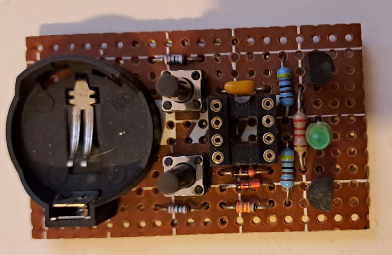
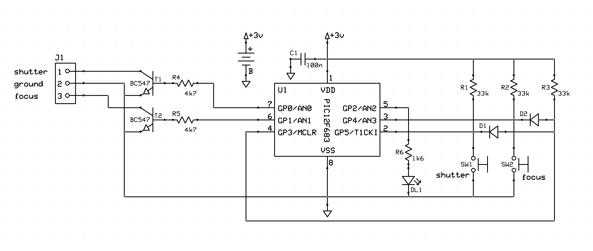
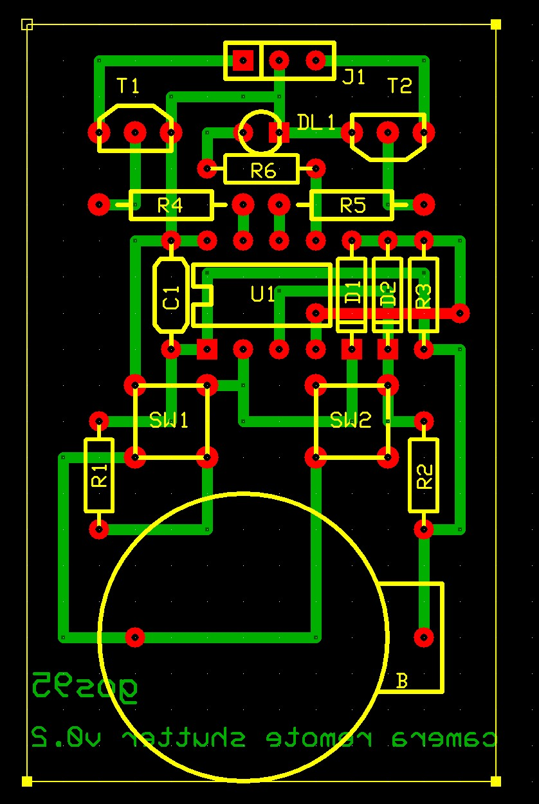

# Camera Remote Shutter
**Type**: Standalone Project | **Status**: Completed

Camera remote shutter and focus trigger controller for the **Canon EOS400D**.

## Overview
This project is a hardware-based solution to trigger the shutter and focus of a DSLR camera like Canon EOS400. 

## Specifications
*   **MCU**: 8-bit Microchip PIC (optimized for the **PIC12F** architecture).
*   **Control Logic**: Dual-stage triggering (Focus and Shutter).
*   **Target Hardware**: Tested on Canon EOS 3-pin remote terminal (EOS 400D).

## Technical Stack
*   **Design**: Schematics and PCB layouts developed with **ExpressPCB** (using custom **[expresspcb-goslib](https://github.com/gom9000/expresspcb-goslib)** assets).
*   **Firmware**: Written in **Microchip Assembler (MPASM)**.
*   **Toolchain**: Microchip MPLAB X IDE.

## Repository Structure
*   `firmware/`: Contains the MPLAB X project and the `.asm` source files.
*   `hardware/`: ExpressPCB schematic (`.sch`) and PCB layout (`.pcb`) files.
*   `media/`: Videos and images of the built device in action.

## Hardware
### Schematic

### PCB Layout

## About & License
**Author**: Alessandro Fraschetti (gom9000). 
**License**: Licensed under the **MIT License**.
